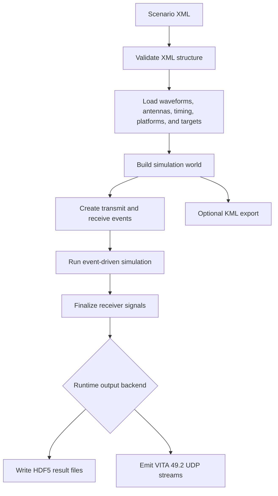
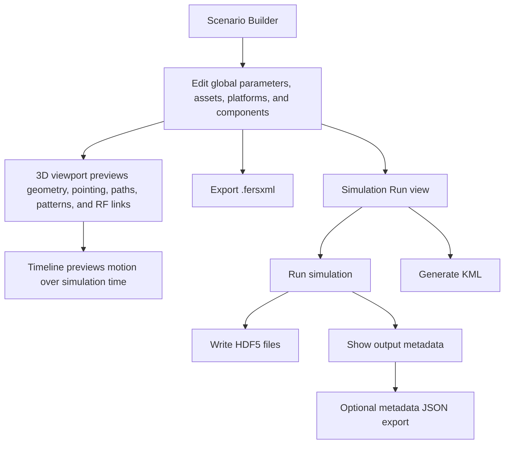
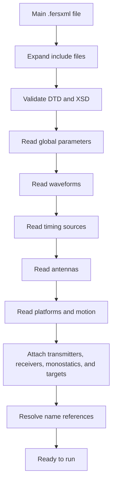
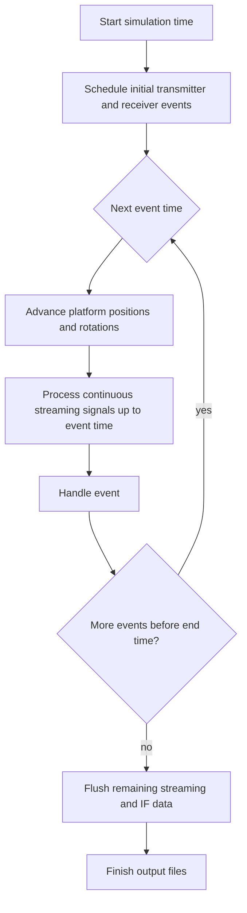
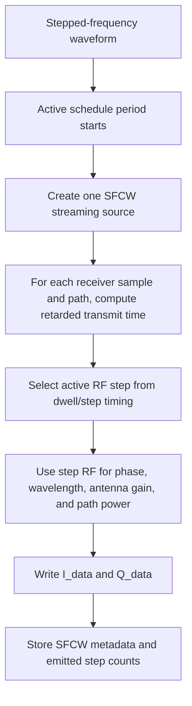
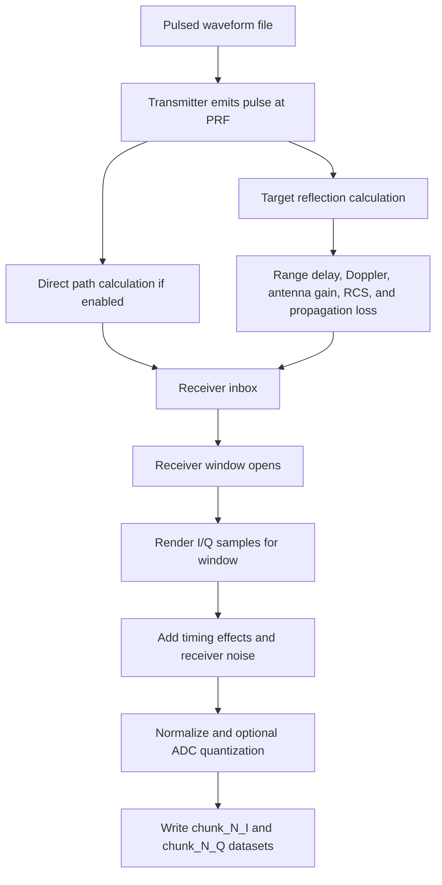
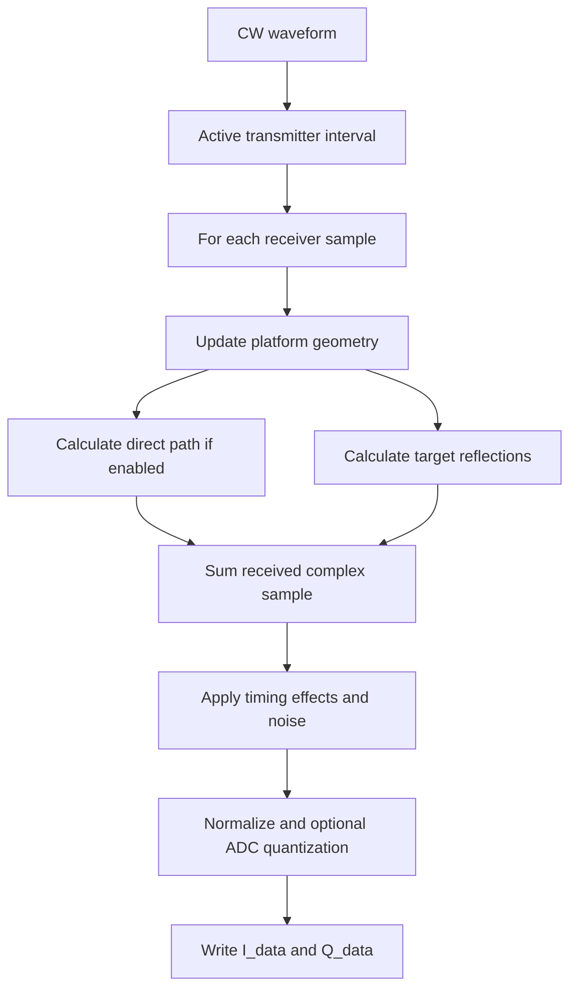
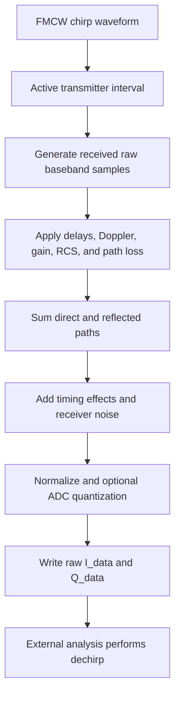
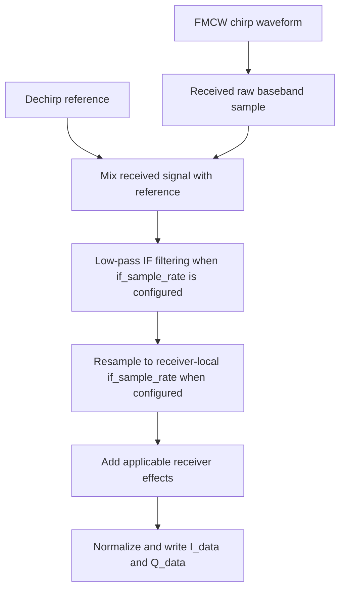
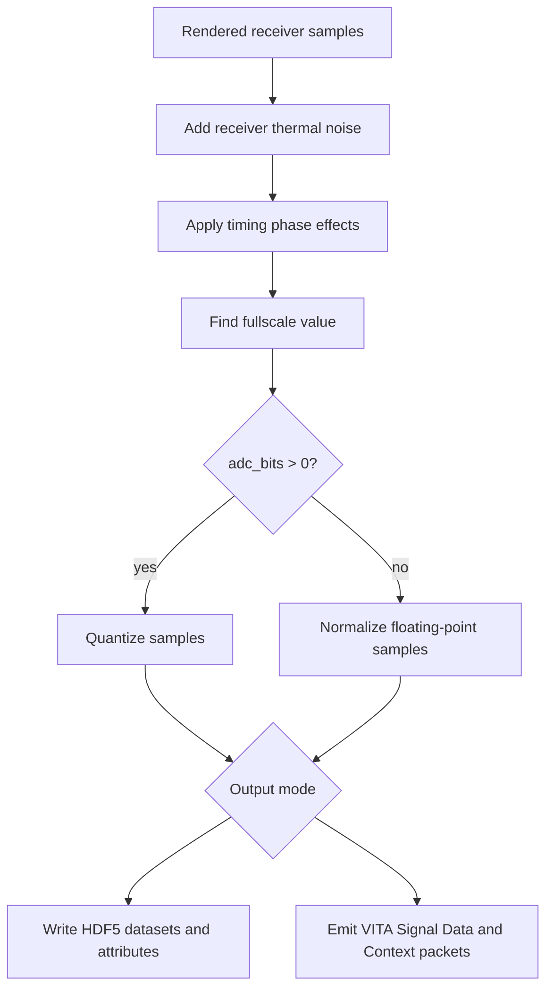

# Simulation Pipelines

This page shows the high-level flow of a FERS run. The diagrams are meant to help users understand what happens to a scenario, why different radar modes produce different output files, and where common settings take effect.

## Whole Run

Key user settings:

- XML structure comes from [[XML Schema Reference]].
- `<rate>`, `<oversample>`, schedules, platform motion, and radar modes affect event generation and signal rendering.
- Receiver names determine HDF5 output file names.
- Runtime CLI/API configuration selects HDF5 or VITA 49.2 UDP output; `.fersxml` does not select network transport.

## UI Scenario Workflow

The UI preview helps catch setup mistakes before a full run, but the generated HDF5 files are the simulation output. Use external analysis tools for signal processing and plots.

## Scenario Loading

What can fail here:

- XML elements are in the wrong order.
- A required parameter is missing.
- A referenced waveform, timing source, or antenna name does not exist.
- A waveform file, antenna file, or RCS file cannot be opened.
- A radar mode does not match its waveform type.

## Event-Driven Simulation

FERS does not simply render every object independently from start to finish. It builds a time-ordered set of events and processes them over the simulation interval.

Events include:

- Pulsed transmitter pulse starts.
- Pulsed receiver window starts and ends.
- CW/FMCW/SFCW transmitter streaming starts and ends.
- CW/FMCW/SFCW receiver streaming starts and ends.

Schedules control when these events are created.

## SFCW Streaming Pipeline

Stepped-frequency continuous-wave radar uses the same streaming event path as CW and raw FMCW, but the active RF frequency changes at each configured step.

Important SFCW settings:

| Setting | Effect |
| --- | --- |
| `<step_size>` | RF spacing between consecutive dwells. Its magnitude controls unambiguous range. |
| `<step_count>` | Number of frequency steps in one sweep. Together with `abs(step_size)`, it controls effective bandwidth. |
| `<dwell_time>` | Active transmit time inside each step period. |
| `<step_period>` | Time from one step start to the next. Larger values introduce silent gaps. |
| `<sweep_count>` | Optional finite number of sweeps per active schedule period. |

## Pulsed Radar Pipeline

Pulsed radar is organized around transmitted pulses and receiver windows.

Important pulsed settings:

| Setting | Effect |
| --- | --- |
| Transmitter `<prf>` | Controls how often pulses are emitted. |
| Receiver `<prf>` | Controls how often receive windows are opened. |
| `<window_skip>` | Delays the start of each receive window. |
| `<window_length>` | Controls the duration and sample count of each receive window. |
| `<simSamplingRate>` | Controls geometry interpolation used in pulsed response generation. |
| `<adc_bits>` | Enables final quantization. |

Pulsed output is written as one I/Q dataset pair per receiver window.

## CW Streaming Pipeline

CW output is continuous over the receiver's active intervals.

Important CW settings:

| Setting | Effect |
| --- | --- |
| `<rate>` | Output sample rate. |
| Schedules | Active transmit and receive intervals. |
| Antenna patterns and platform rotation | Directional gain over time. |
| `nodirect` | Removes direct transmitter-to-receiver path. |
| `nopropagationloss` | Removes path-loss scaling for debugging. |

## FMCW Pipeline Without Built-In Dechirp

Use `dechirp_mode="none"` when you want FERS to write the received FMCW signal and do the dechirp in your own analysis script.

Use this mode when:

- You want full control over dechirping.
- You are testing a custom processing chain.
- You want to compare FERS output with another FMCW processor.

## FMCW Pipeline With Built-In Dechirp

Use `dechirp_mode="physical"` or `dechirp_mode="ideal"` when you want FERS to write IF output directly.

If `if_sample_rate` is omitted, dechirped FMCW is written as legacy full-rate IF output at `<rate> * <oversample>`.

Reference choices:

| Reference | Use when |
| --- | --- |
| `attached` | Monostatic radar dechirps using its own waveform. |
| `transmitter` | Bistatic receiver dechirps against a named transmitter. |
| `custom` | Receiver dechirps against a named waveform. |

Dechirp modes:

| Mode | Meaning |
| --- | --- |
| `physical` | Includes timing-source effects in the reference relationship. |
| `ideal` | Uses an idealized reference for cleaner beat-signal analysis. |

## Output Finalization

Finalization is where FERS turns simulated receiver voltage samples into the selected runtime output backend. HDF5 remains the default. VITA 49.2 UDP uses the same processed receiver samples but scales them against a fixed full-scale value for int16 IQ packets.

Important output behavior:

- Stored samples are normalized.
- Use the HDF5 `fullscale` attribute to reconstruct physical I/Q values.
- Pulsed outputs write chunk datasets.
- CW and FMCW outputs write `I_data` and `Q_data`.
- Metadata attributes describe the receiver mode and sampling settings.
- VITA output uses configured fixed full-scale; clipping is reported through VITA stream statistics and packet indicators.
